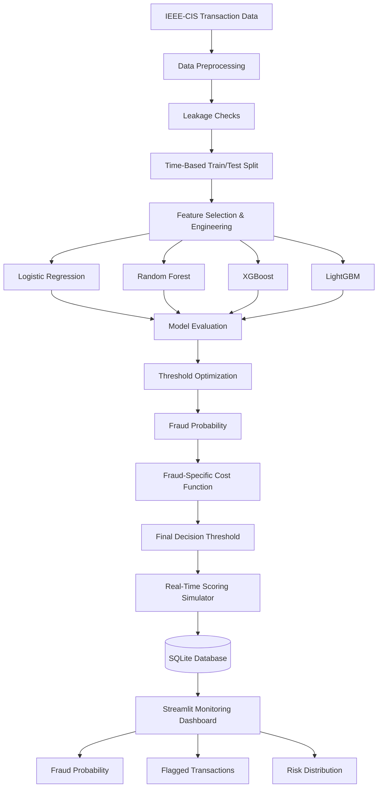
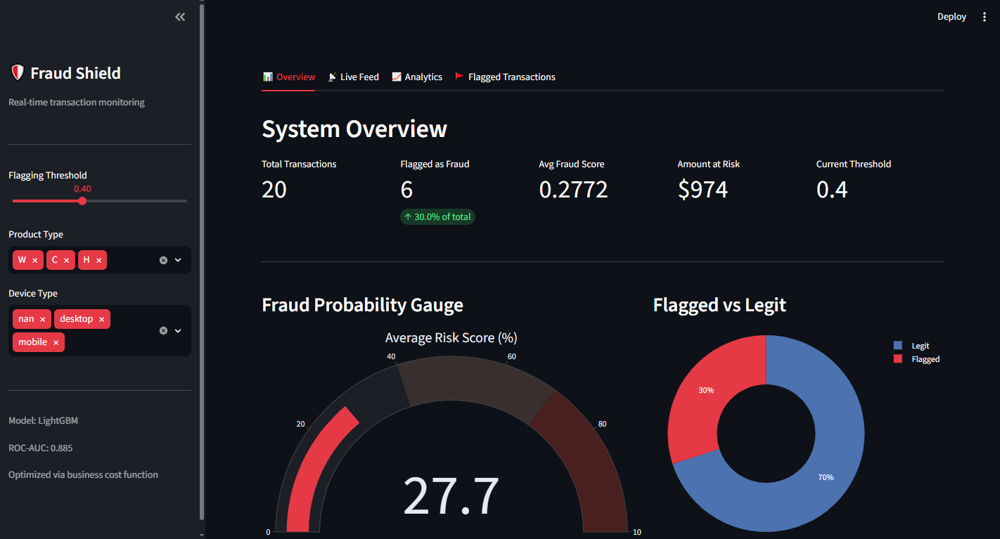
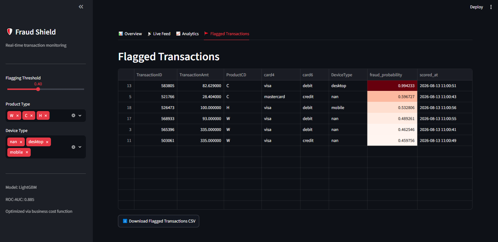
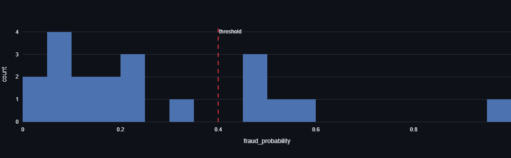
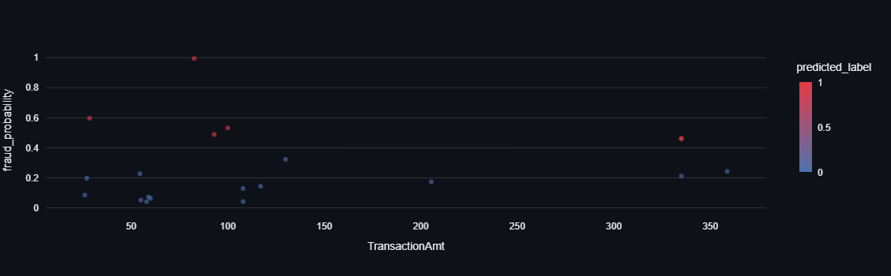
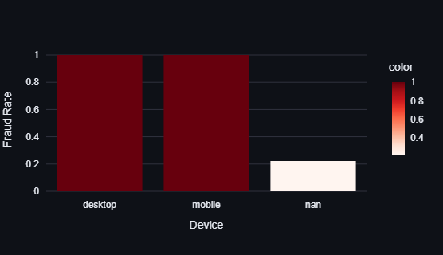
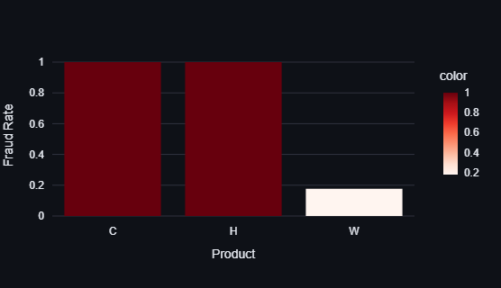
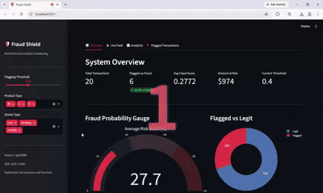

# 🛡️ Real-Time Fraud Detection Pipeline

<p align="center">

**Production-style fraud detection using Machine Learning + SQL + Real-Time Scoring + Interactive Monitoring**

</p>

<p align="center">


</p>

---

## 📌 Overview

Fraud detection is not simply a classification problem.

In real-world financial systems, fraudulent transactions are rare, false alarms can overwhelm investigation teams, and missing a genuine fraud can result in significant financial loss.

This project builds a **production-style end-to-end fraud detection pipeline** using the **IEEE-CIS Fraud Detection dataset**, containing **500K+ transactions and 400+ features**.

The system combines:

* Machine Learning
* Imbalanced classification
* Leakage-aware feature selection
* Time-based model validation
* Cost-sensitive decision making
* Threshold optimization
* SQLite transaction storage
* Real-time transaction simulation
* Interactive fraud monitoring

The goal is to move from:

> **"Can the model predict fraud?"**

to:

> **"Can the system make economically sensible fraud decisions in a realistic transaction workflow?"**

---

## 🎯 Project Highlights

| Area            | Implementation                                        |
| --------------- | ----------------------------------------------------- |
| Dataset         | IEEE-CIS Fraud Detection                              |
| Dataset Size    | 500K+ transactions                                    |
| Features        | 400+                                                  |
| Validation      | Time-based train/test split                           |
| Leakage Control | Leakage-checked feature selection                     |
| Models          | Logistic Regression, Random Forest, XGBoost, LightGBM |
| Imbalance       | Class-imbalance handling                              |
| Optimization    | ROC-AUC + Precision + threshold tuning                |
| Decision Layer  | Fraud-specific cost function                          |
| Database        | SQLite                                                |
| Simulation      | Real-time transaction scoring                         |
| Dashboard       | Streamlit                                             |
| Output          | Fraud probability, risk level & flagged transactions  |

---

## 💡 Why This Project Is Different

A typical fraud detection project might stop here:

```text
Dataset
   ↓
Train Model
   ↓
Accuracy / ROC-AUC
   ↓
Done
```

This project goes further:

```text
Transaction
     ↓
Feature Processing
     ↓
Fraud Detection Model
     ↓
Fraud Probability
     ↓
Business-Aware Threshold
     ↓
Fraud / Legitimate Decision
     ↓
SQLite Database
     ↓
Real-Time Monitoring
     ↓
Streamlit Dashboard
```

This makes the project closer to a **real ML application workflow** rather than a standalone notebook experiment.

---

# 🏗️ System Architecture



---

# 🔬 Machine Learning Workflow

## 1. Data Preparation

The project uses the **IEEE-CIS Fraud Detection dataset**, a large-scale transaction dataset containing hundreds of features.

The preprocessing stage focuses on:

* Missing-value handling
* Categorical feature processing
* Numerical feature processing
* Feature selection
* Leakage checks
* Consistent train/test transformations

---

## 2. Time-Based Train/Test Split

Instead of randomly splitting transactions, the project uses a **time-based split**.

This is important for fraud detection because random splitting can allow information from future transactions to influence model development.

```text
Past Transactions
        │
        ▼
     TRAIN
        │
        │
        ▼
Future Transactions
        │
        ▼
      TEST
```

This better represents the situation where a model is trained on historical transactions and then used to score future transactions.

---

# 🛡️ Leakage-Aware Feature Selection

Fraud datasets can contain features that unintentionally expose information that would not be available at prediction time.

Therefore, feature selection was performed with **data leakage in mind**.

The objective is to ensure that:

> Features used by the model represent information realistically available when the transaction is being scored.

This makes the evaluation more meaningful than simply maximizing validation performance.

---

# 🤖 Models Compared

Four machine learning approaches were evaluated:

### 1. Logistic Regression

Used as a simple and interpretable baseline.

### 2. Random Forest

Captures nonlinear relationships and interactions between transaction features.

### 3. XGBoost

A gradient boosting model designed for strong predictive performance on structured/tabular data.

### 4. LightGBM

A gradient boosting framework optimized for efficient learning on large tabular datasets.

---

# ⚖️ Handling Class Imbalance

Fraud detection is inherently imbalanced because legitimate transactions greatly outnumber fraudulent transactions.

Therefore, model development does not rely on accuracy alone.

The evaluation focuses on metrics such as:

* ROC-AUC
* Precision
* Recall
* F1 Score
* Confusion Matrix
* Business Cost

---

# 📊 Model Evaluation

The project compares models using multiple perspectives rather than selecting a model solely because it has the highest accuracy.

### Key questions

**ROC-AUC**

> How well can the model separate fraudulent and legitimate transactions?

**Precision**

> Of the transactions flagged as fraud, how many are actually fraudulent?

**Recall**

> Of the actual fraudulent transactions, how many did the model identify?

**F1 Score**

> How well does the model balance precision and recall?

**Business Cost**

> What is the financial consequence of the model's decisions?

---

# 💰 Fraud-Specific Cost Optimization

This is one of the main differentiators of the project.

A fraud model can make two important types of mistakes:

### False Negative

A fraudulent transaction is classified as legitimate.

**Potential consequence:**

> Financial loss from missed fraud.

### False Positive

A legitimate transaction is flagged as fraudulent.

**Potential consequence:**

> Investigation cost, customer friction, or unnecessary operational workload.

Therefore, the project uses a **fraud-specific cost function** rather than treating every classification error equally.

---

# 🎯 Threshold Optimization

A model's default classification threshold is not necessarily the best threshold for a fraud detection system.

Instead of automatically using:

```text
Probability ≥ 0.50 → Fraud
Probability < 0.50 → Legitimate
```

the project evaluates multiple thresholds and selects a threshold based on the **business cost of false positives and false negatives**.

```text
Predicted Probability
        │
        ▼
┌─────────────────────┐
│ Threshold Evaluation│
└─────────────────────┘
        │
        ▼
Business Cost
        │
        ▼
Optimal Threshold
```

This converts a raw probability score into an operational fraud decision.

---

# 📉 Business Impact

The optimized decision strategy achieved an estimated **~60% reduction in projected fraud-related cost compared with the naive baseline** used in the project.

> **Important:** This is a modeled/projected business result based on the project's cost assumptions, not a claim of realized production savings.

This distinction matters because actual production economics would depend on factors such as:

* Fraud recovery rates
* Investigation costs
* Customer friction
* Chargeback costs
* Operational capacity
* Intervention effectiveness

---

# 🗄️ Transaction Database

The system uses **SQLite** to persist transaction and prediction information.

The database separates:

### Transactions

Stores transaction-level information.

```text
TransactionID
TransactionDT
TransactionAmt
ProductCD
card4
card6
DeviceType
received_at
```

### Predictions

Stores model scoring results.

```text
TransactionID
fraud_probability
predicted_label
scored_at
```

This creates a simple but realistic persistence layer between the scoring system and dashboard.

---

# ⚡ Real-Time Transaction Simulation

The project includes a transaction simulation component that mimics incoming transactions.

The workflow is:

```text
Simulated Transaction
        ↓
ML Model
        ↓
Fraud Probability
        ↓
Threshold Decision
        ↓
SQLite
        ↓
Dashboard
```

This allows the project to demonstrate how a fraud model could operate within a continuous transaction-scoring workflow.

---

# 📊 Dashboard

The Streamlit dashboard provides a monitoring layer over the fraud detection pipeline.

### Dashboard capabilities include:

* Fraud probability monitoring
* Flagged transaction visibility
* Risk distribution
* Transaction-level prediction information
* Real-time scoring visibility

---

## 📸 Dashboard Preview

### 🏠 Fraud Monitoring Overview

<p align="center">

</p>

---

### 🚨 Flagged Transactions

<p align="center">

</p>

---

### ⚠️ Risk Distribution

<p align="center">

</p>

---

### 📊 Visualizations

<p align="center">
<b> Amount VS Score</b>
</p>

<div align="center">
  <table>
    <tr>
      <td align="center">
        <br />
        <b>Fraud Rate by Device</b>
      </td>
      <td align="center">
        <br />
        <b>Fraud Rate by Product</b>
      </td>
    </tr>
  </table>
</div>


---

## 🎥 Live Simulation

<p align="center">

</p>

> A short demonstration of transactions being scored and reflected in the monitoring dashboard.

---

# 📁 Project Structure

```text
Real-Time-Fraud-Detection-Pipeline/
│
├── assets/
│   ├── dashboard-overview.png
│   ├── flagged-transactions.png
│   ├── risk-distribution.png
│   └── demo.gif
│
├── data/
│   ├── raw/
│   └── processed/
│
├── notebooks/
│   └── fraud_detection.ipynb
│
├── artifacts/
│   ├── cat_cols.pkl
│   ├── encoders.pkl
|   ├── feature_cols.pkl
│   └── fraud_model.pkl
│
├── database/
│   └── fraud_detection.db
│
├── dashboard/
│   └── app.py
│
├── requirements.txt
├── README.md
├── LICENSE
└── .gitignore
```

> Adjust this structure to match the actual files in the repository. Don't create empty folders just for presentation.

---

# ⚙️ Installation

Clone the repository:

```bash
git clone https://github.com/yourusername/Real-Time-Fraud-Detection-Pipeline.git
```

Navigate to the project:

```bash
cd Real-Time-Fraud-Detection-Pipeline
```

Create a virtual environment:

```bash
python -m venv .venv
```

Activate it on Windows:

```bash
.venv\Scripts\activate
```

Activate it on macOS/Linux:

```bash
source .venv/bin/activate
```

Install dependencies:

```bash
pip install -r requirements.txt
```

---

# ▶️ Running the System

## Train the Model

Run the training workflow:

```bash
python src/train.py
```

This produces the required model artifacts.

---

## Start the Real-Time Simulator

```bash
python src/simulator.py
```

The simulator generates/scorers transactions and stores the results in SQLite.

---

## Launch the Dashboard

```bash
streamlit run dashboard/app.py
```

The dashboard can then be used to monitor transaction risk and flagged activity.

> Update these commands if your actual filenames differ.

---

# 🔄 End-to-End Flow

```text
       ┌──────────────────┐
       │ IEEE-CIS Dataset │
       └────────┬─────────┘
                ↓
       ┌──────────────────┐
       │ Preprocessing    │
       └────────┬─────────┘
                ↓
       ┌──────────────────┐
       │ Model Training   │
       └────────┬─────────┘
                ↓
       ┌──────────────────┐
       │ Model Comparison  │
       └────────┬─────────┘
                ↓
       ┌──────────────────┐
       │ Threshold Tuning  │
       └────────┬─────────┘
                ↓
       ┌──────────────────┐
       │ Fraud Probability│
       └────────┬─────────┘
                ↓
       ┌──────────────────┐
       │ Real-Time Scorer │
       └────────┬─────────┘
                ↓
       ┌──────────────────┐
       │ SQLite Database  │
       └────────┬─────────┘
                ↓
       ┌──────────────────┐
       │ Streamlit        │
       │ Dashboard        │
       └──────────────────┘
```

---

# 🧰 Technology Stack

| Technology          | Purpose                          |
| ------------------- | -------------------------------- |
| Python              | Core development                 |
| Pandas              | Data manipulation                |
| NumPy               | Numerical computation            |
| Scikit-learn        | ML algorithms & evaluation       |
| LightGBM            | Gradient boosting                |
| XGBoost             | Gradient boosting                |
| Random Forest       | Ensemble classification          |
| Logistic Regression | Baseline classifier              |
| Imbalanced-learn    | Class imbalance handling         |
| Joblib              | Model persistence                |
| SQLite              | Transaction & prediction storage |
| Streamlit           | Interactive dashboard            |
| Plotly              | Data visualization               |

---

# 📌 Key Takeaways

This project demonstrates how a machine learning model can be integrated into a broader analytical system.

### Machine Learning

* Imbalanced classification
* Multiple model comparison
* ROC-AUC optimization
* Precision/Recall analysis
* Threshold tuning

### Data Science

* Time-aware validation
* Leakage prevention
* Feature selection
* Business metric design

### Data Engineering

* Transaction persistence
* SQL database integration
* Real-time simulation

### Deployment & Monitoring

* Model serialization
* Real-time scoring
* Interactive Streamlit dashboard

---

# 🚀 Future Improvements

Potential production extensions include:

* REST API for real-time scoring
* PostgreSQL instead of SQLite
* Kafka-based transaction streaming
* Model explainability with SHAP
* Model drift monitoring
* Automated retraining
* Docker containerization
* Cloud deployment
* Authentication and role-based dashboard access
* Alerting for high-risk transactions
* MLflow experiment tracking

---

# ⚠️ Limitations

This project is a production-style portfolio implementation rather than a live financial fraud prevention service.

The modeled business cost depends on assumptions defined within the project.

Real-world deployment would require:

* Production-grade data pipelines
* Robust monitoring
* Model governance
* Security controls
* Latency requirements
* Human review workflows
* Regulatory compliance
* Periodic model retraining

---

# 👨‍💻 Skills Demonstrated

```text
Machine Learning
Fraud Detection
Imbalanced Classification
Cost-Sensitive Learning
Threshold Optimization
Feature Selection
Data Leakage Prevention
Time-Based Validation
LightGBM
XGBoost
Random Forest
Logistic Regression
SQL
SQLite
Real-Time Scoring
Streamlit
Data Visualization
Python
```

---

# ⭐ Project Summary

> **A production-style fraud detection pipeline that moves beyond model accuracy by combining time-aware machine learning, leakage-conscious feature selection, cost-sensitive threshold optimization, SQL transaction storage, real-time scoring simulation, and interactive risk monitoring.**

---

## 📄 License

This project is licensed under the MIT License.

---

<p align="center">

### ⭐ If you found this project interesting, consider giving the repository a star!

**Built as a practical exploration of Machine Learning, fraud analytics, and production-style ML systems.**

</p>
